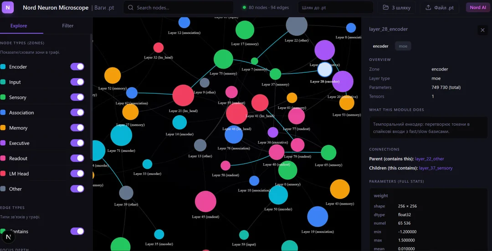

<p align="center">
  
</p>

<h1 align="center">⚡ Project Nord v5.0 — Genesis Autogenic</h1>

<p align="center">
  <b>The World's Largest Spiking Neural Network Language Model Trained From Scratch</b><br>
  <i>1.088B Parameters · 93% Sparsity · Brain-Inspired Zonal Architecture · No Pretrained Teacher · No ANN-to-SNN Conversion</i>
</p>

<p align="center">
  <a href="https://www.reddit.com/r/LocalLLaMA/"></a>
  
  
  
  
  
  <a href="https://huggingface.co/zerdovzad/Nord-AI"></a>
  <a href="https://www.nord-ai.net"></a>
</p>

---

## 🧠 What is Nord?

Nord is a **spiking neural network (SNN) language model** that processes text through biologically realistic discrete binary spikes — the same computational primitive used by biological neurons. Unlike conventional transformers that activate 100% of parameters on every token, Nord sustains **93% sparsity**, meaning only **7% of neurons fire** at any given moment.

The prevailing consensus in SNN research holds that training a language model directly in the spike domain from random initialization is **intractable** at scale. Prior work uniformly circumvented this through knowledge distillation (SpikeBERT, SpikingBERT), ANN-to-SNN conversion (SpikeLLM), or hybrid continuous-valued activations.

**Nord rejects all such concessions.** Trained from random initialization on FineWeb-Edu using surrogate-gradient backpropagation, Nord is the **first SNN language model to converge at billion-parameter scale** — directly contradicting the documented consensus.

> *"We found that the whole model failed to converge due to self-accumulating dynamics"*
> — SpikeBERT (Lv et al., 2023), documenting from-scratch training failure

> *"The additional overheads of training a spiking LM from scratch prompted us to seek out more proficient approaches"*
> — SpikingBERT (Bal & Sengupta, 2024), choosing distillation over direct training

**Nord broke through both barriers.**

---

## 🏆 Key Results

| Metric | v4.2 (618M) | **v5.0 Genesis (1.088B)** |
|--------|-------------|--------------------------|
| Parameters | 618.8M | **1,088,600,000** |
| Training loss (CE) | 3.65 | **4.4 at 27K steps** |
| Activation sparsity | 87-93% avg | **93% avg, peaks 97-99.8%** |
| Architecture | 3 zones, feedforward | **3 zones + Genesis Memory** |
| Memory system | Single MemoryCortex | **Triple-purpose (Structural + Personal + Auxiliary)** |
| STDP | Basic reward-modulated | **Entropy-gated + neuromodulation** |
| Training data | FineWeb-Edu + OpenHermes | **FineWeb-Edu + OpenHermes (~9.67M samples)** |
| Pretrained teacher | None | **None** |
| ANN-to-SNN conversion | None | **None** |

---

## 📝 Sample Generation (step 25,000, loss ~4.6)

Nord generates grammatically correct multilingual text with philosophical coherence — at 93% sparsity:

> *Причина в том, что у нас нет ни малейшего представления о том, как мы можем облегчить себе жизнь. Первое, о чем вы подумаете, это то, что есть вещи, которые делают многие люди, рождающиеся вместе с нами. Это потому, что это дает нам возможность делать что-то другое. Это также помогает нам задуматься о том, что мы знаем, когда это происходит. Мы должны быть осторожны не только в том, чтобы осознавать это. Мы хотим видеть себя, а также понимать это в полной мере. Поэтому нам нужно учиться у них.*

The model was **not specifically trained on Russian** — multilingual capability emerged from the mixed-language training corpus. Near-perfect Russian grammar generated by an SNN with 93% of neurons silent.

---

## 📊 Version History

| Version | Parameters | Loss | Sparsity | Key Innovation | Cost |
|---------|-----------|------|----------|---------------|------|
| v3.0 | 144M | ~4.9 | 97% | First SNN LM, original architecture | ~$10 |
| v4.2 | 618M | 3.65 | 87-93% | Zonal specialization, MoE, Memory Cortex | ~$260 |
| **v5.0** | **1.088B** | **4.4** | **93%** | **Genesis Memory, Identity GRU, Archive RAG, STDP** | **~$400** |

Total project cost: **~$670** for the world's largest from-scratch SNN language model.

---

## 🔬 Comparison with All SNN Language Models

| Model | Method | Scale | From scratch? | Spiking attention? |
|-------|--------|-------|---------------|-------------------|
| **Nord v5.0 (this work)** | **Pure spike domain, surrogate grad** | **1.088B** | **✅ Yes** | **✅ Yes** |
| Nord v4.2 | Pure spike domain, surrogate grad | 618M | ✅ Yes | ✅ Yes |
| SpikeGPT (Zhu 2023) | From scratch (RWKV, no spiking attn) | 216M | ✅ Yes | ❌ No |
| SpikeBERT (Lv 2023) | Distillation from BERT | BERT-scale | ❌ Failed | ❌ No |
| SpikingBERT (Bal 2024) | Distillation from BERT | BERT-scale | ❌ Too expensive | ❌ No |
| SpikeLLM (Xing 2024) | ANN-to-SNN conversion | 7B-70B | ❌ No | ❌ No |
| BrainTransformers (Tang 2024) | ANN→convert→STDP fine-tune | 3B | ❌ No | ❌ No |

Nord is **5× larger** than SpikeGPT (216M) and the **only** SNN language model with native spiking attention trained from scratch.

---

## 🧬 Architecture (v5.0 Genesis Autogenic)

```
┌─────────────────────────────────────────────────────────────────────┐
│                     TEMPORAL SPIKE ENCODER                          │
│          Token → 8 fast + 2 slow timestep currents                  │
│          d_model=2048, vocab=128,256 (LLaMA-3 tokenizer)           │
├─────────────────────────────────────────────────────────────────────┤
│  ┌───────────────┐   Spike rates: 3-7%                             │
│  │   SENSORY     │   3 blocks, FFN + LIF                           │
│  │   ZONE        │   Feature extraction (quiet)                    │
│  └───────┬───────┘                                                  │
│  ┌───────▼───────┐   Spike rates: 4-12%                            │
│  │  ASSOCIATION  │   3 blocks, Spike-Driven MoE                    │
│  │     ZONE      │   8 experts, top-2 routing, 128 clusters        │
│  └───────┬───────┘                                                  │
│  ┌───────▼───────┐   ┌──────────────────────┐                      │
│  │    MEMORY     │   │  GENESIS MEMORY v5.0  │                     │
│  │   CORTEX      │   │  ├─ Structural (96n)  │ Identity GRU        │
│  │  τ=0.99       │   │  ├─ Personal  (96n)   │ + Archive RAG       │
│  │  8 read heads │   │  └─ Auxiliary  (64n)  │ (32 slots)          │
│  └───────┬───────┘   └──────────┬───────────┘                      │
│  ┌───────▼──────────────────────▼───┐                               │
│  │          EXECUTIVE ZONE          │   Spike rates: 4-33%         │
│  │      4 blocks, FFN + LIF         │   Decision & output          │
│  │   Non-negative readout (ReLU)    │   (loudest zone)             │
│  └───────────────┬──────────────────┘                               │
│  ┌───────────────▼──────────────────┐                               │
│  │    EMA READOUT + LM HEAD         │                               │
│  │  Spike integration → 128K logits │                               │
│  └──────────────────────────────────┘                               │
└─────────────────────────────────────────────────────────────────────┘
```

### Parameter Breakdown (1.088B)

| Component | Parameters | Description |
|-----------|-----------|-------------|
| Temporal Spike Encoder | ~263M | Embeddings + temporal projection |
| Sensory Zone | ~185M | 3 blocks, feature extraction |
| Association Zone | ~185M | 3 blocks, Spike-Driven MoE (8 experts) |
| Memory Cortex | ~1.7M | Persistent LIF, τ=0.99, gated temporal attention |
| Genesis Triple Memory | ~1.3M | Structural + Personal + Auxiliary banks |
| Genesis Identity | ~0.4M | GRU-based identity persistence |
| Genesis Archive | ~0.2M | RAG-style key-value retrieval (32 slots) |
| Executive Zone | ~185M | 4 blocks, decision and output |
| Readout + LM Head | ~263M | EMA smoothing + vocabulary projection |
| STDP Engine | ~3M | Reward-modulated, entropy-gated |
| **Total** | **1,088.6M** | |

---

## 🧪 Core Mechanisms

### AssociativeLIF Neurons
Leaky integrate-and-fire neurons with **learnable** membrane time constants, voltage thresholds, and synaptic dynamics. Minicolumn cascade amplification across 128 clusters models lateral excitation. Sub-threshold state preserved through **LeakyClamp** nonlinearity — solving the dead neuron problem that caused prior SNN training failures.

### Spiking Synaptic Resonance
Replaces dense self-attention. Query and Key projections pass through **independent LIF neurons** producing binary spike patterns across T=10 timesteps. Learned temporal mixing weights assign importance to each timestep. Top-K=64 score retention yields **87.5% attention sparsity**.

### Spike-Driven MoE
Mixture-of-Experts routing determined by **spike firing rates** across neuron clusters. No learned router network — routing emerges from spike dynamics. 8 experts, top-2 active per token.

### EMA Temporal Readout
Exponential moving average bridges binary spikes to continuous logits. Per-channel learned decay α ≈ 0.80. Most recent timestep (T9) contributes **7× more** than earliest (T0).

### Reward-Modulated STDP
Three-factor spike-timing-dependent plasticity operating **synergistically** with backpropagation. Entropy-gated: updates only when model uncertainty exceeds threshold.

### Genesis Triple Memory (v5.0)
Three parallel memory banks — Structural (96 neurons, architectural patterns), Personal (96 neurons, contextual continuity), Auxiliary (64 neurons, overflow). Purpose router learns to allocate information. Identity GRU maintains coherence across context. Archive Grid provides RAG-style retrieval from 32 learned key-value slots.

---

## 📊 Emergent Zonal Specialization

From **uniform random initialization**, Nord spontaneously develops distinct firing-rate hierarchies:

```
                140M                           618M / 1.088B
    ┌──────────────────────┐      ┌──────────────────────────┐
    │ Sensory:    8-10%    │      │ Sensory:     3-7%  ▼     │
    │ Association:10-14%   │      │ Association: 4-12%       │
    │ Memory:     0.5-1%   │  →   │ Memory:      39%   ▲39×  │
    │ Executive:  11-26%   │      │ Executive:   4-33%       │
    └──────────────────────┘      └──────────────────────────┘
```

**Key discovery:** Memory Cortex activation increased **39×** when scaling from 140M to 618M. The model learned that persistent memory is more valuable at larger scale. **Not programmed — emerged.**

---

## ⚡ Live Spike Visualization

```
┌──────────────────────────────────────────────────────────────┐
│ Neural Activity (1.088B model)                               │
├──────────────────────────────────────────────────────────────┤
│ ⚡ Sensory      ███·····························   5.2%  │
│ ⚡ Association  █████···························   8.7%  │
│ ⚡ Memory       ████████████████████████████████·  38.9% │
│ ⚡ Executive    ███████████████··················  24.1% │
├──────────────────────────────────────────────────────────────┤
│ 🧠 Sparsity: 93% silent  (7% neurons active per token)      │
│ ⚡ Only 7% fire — just like a real brain                     │
└──────────────────────────────────────────────────────────────┘
```

---

## 📈 Training History

### v5.0 (1.088B parameters)

| Step | Loss | Sparsity | Milestone |
|------|------|----------|-----------|
| 0 | 13.4 | 68% | Random initialization |
| 5,000 | 5.30 | 87% | Basic grammar emerging |
| 10,000 | 5.00 | 91% | Thematic coherence |
| 22,000 | 4.57 | 86% | Solid language model |
| 25,000 | 4.60 | 93% | Multilingual philosophical text |
| 27,000 | **4.40** | **93%** | **Training complete** |

### Knowledge Distillation (Qwen 3.5-2B teacher)

| Step | CE Loss | KD Loss | Note |
|------|---------|---------|------|
| 22,000 | 4.57 | — | KD started |
| 22,010 | 5.14 | 2.560 | Initial shock (expected) |
| 22,070 | 4.88 | 0.785 | **Converged in 70 steps** |
| 25,000 | 4.71 | 0.590 | Stable calibration |

**KD converged in 70 steps** — Nord already had rich internal representations from spike dynamics. The teacher merely calibrated the output distribution.

---

## 💬 Generation Examples

**Loss 3.65 (v4.2, 618M) — Instruction following:**
```
You: What is a computer?
Nord: A computer science degree plays an important role in the development 
of software and system application. It will help to get rid of a recording 
process by creating computing elements...
```

**Loss 4.4 (v5.0, 1.088B) — Philosophical text (Russian, unprompted):**
```
Причина в том, что у нас нет ни малейшего представления о том, как мы 
можем облегчить себе жизнь. Первое, о чем вы подумаете, это то, что 
есть вещи, которые делают многие люди, рождающиеся вместе с нами.
Это потому, что это дает нам возможность делать что-то другое.
```

**v4.2 vs GPT-2 Small on "How does encryption protect data?":**

| | Nord (144M) | GPT-2 Small (124M) |
|---|---|---|
| Relevant terms used | encryption, decrypt, public key, authentication, attack | browsers, cookies, cybernetics |
| Topic coherence | ✅ Stays on topic | ❌ Drifts to unrelated subjects |
| Sparsity | 97% (3% active) | 0% (100% active) |

Nord uses **33× fewer active neurons** than GPT-2 while maintaining superior topic coherence on comparable prompts.

---

## 🚀 Quick Start

```bash
git clone https://github.com/gtausa197-svg/-Project-Nord-Spiking-Neural-Network-Language-Model.git
cd Project-Nord
pip install torch transformers datasets lmdb numpy
```

### Training

```bash
# v5.0 (1.1B with Genesis)
python train_nord_kd.py --dataset train_data.jsonl \
    --model_dir checkpoints/nord --preset 1.1b --genesis-v5

# With Knowledge Distillation from Qwen
python train_nord_kd.py --dataset train_data.jsonl \
    --model_dir checkpoints/nord --preset 1.1b --genesis-v5 \
    --kd-teacher Qwen/Qwen3.5-2B --kd-weight 0.5

# Continued training on new data
python train_nord_kd.py --dataset new_data.jsonl \
    --model_dir checkpoints/nord --preset 1.1b --genesis-v5 --continued

# Dataset download and preparation
python download_data.py
```

### Interactive Chat

```bash
python chat_v4.py
# Commands: /tokens, /temp, /rep, /live, /stats, /memory, /expert, /help
```

---

## 📁 Project Structure

```
nord/
├── nord_core_700m.py          # Core architecture v5.0 (1.088B)
├── train_nord_kd.py           # Training + Knowledge Distillation
├── train_nord_tpu_700m.py     # Training (CUDA + TPU support)
├── chat_v4.py                 # Interactive chat with spike visualization
├── chat_v4_cpu_offload.py     # Chat with CPU offloading (low VRAM)
├── download_data.py           # Dataset downloader (8 datasets)
├── assets/                    # Banners, diagrams
└── README.md
```

---

## 🧠 Why This Matters

### The Impossible Result
Every major SNN language modeling paper documented that from-scratch training fails at scale. Nord proved them wrong — at **5× the scale** of any prior attempt.

### Energy Efficiency
At 93% sparsity, only 7% of neurons fire per token. On neuromorphic hardware (Intel Loihi, SynSense), **inactive neurons consume zero energy**. This implies a potential **10-100× energy reduction** compared to dense transformers.

### Visible "Thinking"
Spike rate analysis shows which zones process information: Sensory filters noise (3-7%), Association binds features (4-12%), Memory stores context (39%), Executive makes decisions (4-33%). **You can literally see where the model thinks.** This interpretability comes free with SNN architecture.

### Online Learning via STDP
Nord updates weights **during conversation** using Spike-Timing Dependent Plasticity — a biological learning rule. The model adapts in real-time without retraining.

### 33× Fewer Active Neurons Than GPT-2
On comparable prompts, Nord uses 3% active neurons vs GPT-2's 100% — while maintaining superior topic coherence. Sparse activation acts as a natural relevance filter.

---

## 🗺️ Roadmap

- [x] v3.0 — First SNN language model (144M, ~$10)
- [x] v4.2 — Zonal specialization, MoE, Memory Cortex (618M, loss 3.65, ~$260)
- [x] v5.0 — Genesis Autogenic (1.088B, loss 4.4, ~$400)
- [x] Knowledge Distillation from Qwen 3.5-2B (converged in 70 steps)
- [x] Preprint with peer-reviewed citations (Zenodo)
- [x] Prof. Kasabov (NeuCube creator) responded positively
- [ ] NeurIPS 2026 paper submission
- [ ] WikiText-103 / MMLU benchmark evaluation
- [ ] Neuromorphic hardware deployment

---

## 📖 References

| Component | Citation | DOI |
|-----------|----------|-----|
| Surrogate Gradient | Neftci et al. (2019) | 10.1109/MSP.2019.2931595 |
| Cortical Columns | Mountcastle (1997) | 10.1093/brain/120.4.701 |
| STDP | Bi & Poo (1998) | 10.1523/JNEUROSCI.18-24-10464.1998 |
| MoE / Association Cortex | Felleman & Van Essen (1991) | 10.1093/cercor/1.1.1 |
| Memory Cortex / CA1 | Vinogradova (2001) | 10.1002/hipo.1073 |
| CLS Theory | Kumaran et al. (2016) | 10.1016/j.tics.2016.05.004 |
| Predictive Coding | Friston (2005) | 10.1098/rstb.2005.1622 |
| Dendritic Computation | Gidon et al. (2020) | 10.1126/science.aax6239 |
| NeuCube | Kasabov (2014) | 10.1016/j.neunet.2013.10.001 |

---

## 📄 Citation

```bibtex
@software{nord2026,
  title={Project Nord: Brain-Inspired Spiking Neural Network Language Model},
  author={Makarenko, Volodymyr},
  year={2026},
  url={https://github.com/gtausa197-svg/-Project-Nord-Spiking-Neural-Network-Language-Model}
}
```

---

## 🤝 Community & Links

- 🌐 **Website**: [www.nord-ai.net](https://www.nord-ai.net)
- 🤗 **HuggingFace**: [zerdovzad/Nord-AI](https://huggingface.co/zerdovzad/Nord-AI)
- 💬 **Discord**: [Join](https://discord.gg/cFghG89P)
- 📄 **Preprint**: [Zenodo](https://zenodo.org/records/19183472)
- 📚 **Wiki**: [GitHub Wiki](https://github.com/gtausa197-svg/-Project-Nord-Spiking-Neural-Network-Language-Model/wiki)

## License

Apache 2.0

## Acknowledgments
- **Prof. Nikola Kasabov** (KEDRI/AUT) — NeuCube inspiration, positive feedback
- **Bo Peng** (RWKV) — Public encouragement and challenge
- FineWeb-Edu & OpenHermes 2.5 — HuggingFace / Teknium
- Visual presentation by [mnbnkr](https://mnbnkr.github.io/-Project-Nord-Spiking-Neural-Network-Language-Model/)

---

<p align="center">
  <i>⚡ "Only 7% of neurons fire at any time — just like a real brain."</i><br>
  <b>1.088 billion spiking neurons. 93% silent. Trained from scratch. $670 total.</b><br>
  <b>Built. 18 years old. Ukraine → Norway.</b><br>
  <br>
  <a href="https://www.nord-ai.net">www.nord-ai.net</a>
</p>
