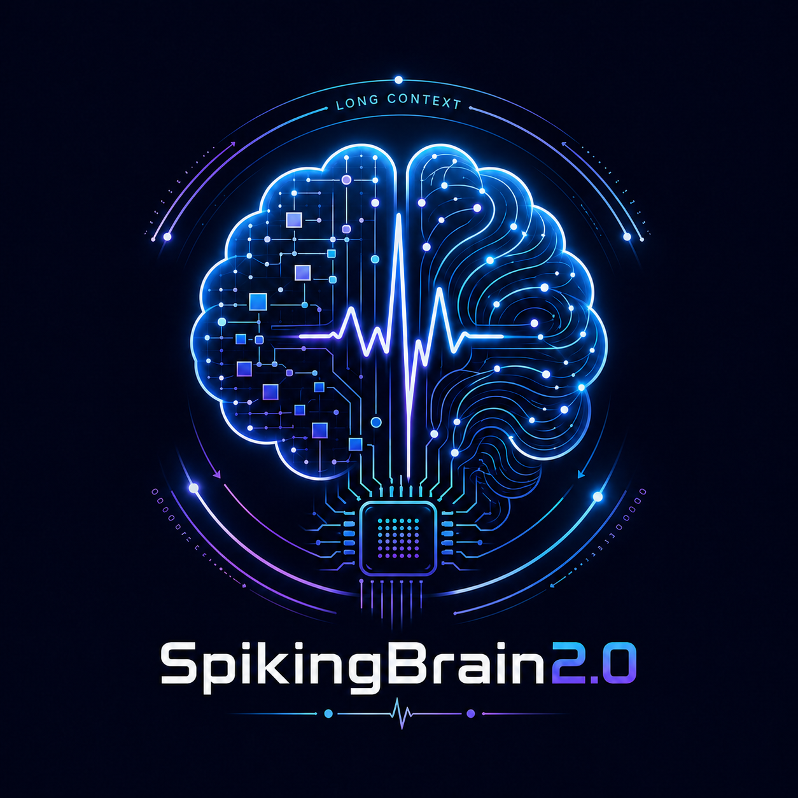
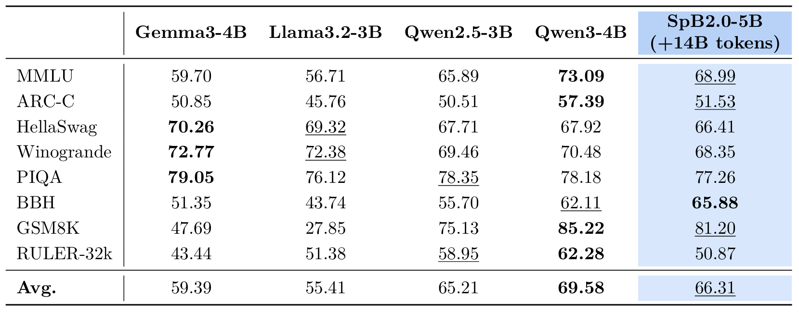
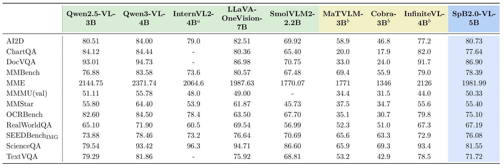

<div align="center">
  <h1>
    SpikingBrain2.0<br>
    Brain-Inspired Foundation Models
  </h1>

  

  <h3>Efficient Long-Context and Cross-Platform Inference</h3>

  <p>
    <a href="https://arxiv.org/abs/2604.22575">📑 Paper</a>
    &emsp;
    <a href="#available-models">🤖 Models</a>
  </p>
</div>

---

## About SpikingBrain2.0

Building on [SpikingBrain1.0](https://github.com/BICLab/SpikingBrain-7B), **SpikingBrain2.0** advances brain-inspired hybrid foundation modeling with two 5B-scale models, **SpB2.0-5B** and **SpB2.0-VL-5B**. Its architecture introduces **Dual-Space Sparse Attention (DSSA)**, an inter-layer hybrid of Sparse Softmax Attention ([MoBA](https://arxiv.org/abs/2502.13189)) and Sparse Linear Attention ([SSE](https://arxiv.org/abs/2507.16577)), together with **Dual-Path Activation Coding**, which supports both FP8 GPU inference and INT8-Spiking event-driven computation. On the training side, SpikingBrain2.0 develops an optimized **Transformer-to-Hybrid (T2H)** conversion pipeline for LLM and VLM, enabling efficient migration from open-source Transformer backbones. Empirically, SpikingBrain2.0 recovers most of the base Transformer capability while achieving a **10.13× TTFT speedup** at 4M context length, with its spiking computation path further showing potential for low-power neuromorphic deployment.


## Repository Structure

```text
SpikingBrain2.0/
├── spb2/                        # Hugging Face implementation of SpB2.0-5B
├── spb2vl/                      # Hugging Face implementation of SpB2.0-VL-5B
├── spb2_vllm/                   # vLLM inference plugin adapted for both SpB2.0-5B and SpB2.0-VL-5B
├── flash-linear-attention_dev/  # Customized flash-linear-attention with SSE support
├── MoBA/                        # Customized MoBA adapted to the newer FlashAttention interface
├── run_model/                   # Example scripts for running models with the released checkpoints
├── run_model_forward/           # Example scripts for forward / training step with the released checkpoints
└── README.md
```

## Dependency Notes

This repository includes two important local dependency trees.


`flash-linear-attention_dev/` contains a modified version of [flash-linear-attention](https://github.com/fla-org/flash-linear-attention/tree/main) with added support for SSE. In SpikingBrain2.0, SSE is implemented as a sparse state expansion mechanism on top of Gated DeltaNet, enabling improved long-context retrieval with controllable computation and parameter overhead.

---

`MoBA/` contains a customized [MoBA](https://github.com/MoonshotAI/MoBA) implementation whose interfaces were adapted to the newer FlashAttention API used by this repository. This bundled `MoBA/` directory is intended for the **Hugging Face side** of the repository. For the **vLLM side**, `spb2_vllm` does **not** use the bundled `MoBA/`. Instead, it depends on the official **`flash-moba`** package.

Official repository:

- `https://github.com/mit-han-lab/flash-moba`


## Environment Setup

It is recommended to create separate environments for different components if needed.

### Hugging Face LLM (spb2)

#### Setup suggestion

```text
transformers==4.57.1
triton==3.2.0
flash-attn==2.7.3
flash-linear-attention_dev  # use the local version in this repo
MoBA                        # use the local version in this repo
```

### Hugging Face VLM (spb2vl)

#### Setup suggestion

```text
transformers==4.57.3
flash_attn==2.6.3
flash-linear-attention_dev  # use the local version in this repo
MoBA                        # use the local version in this repo
```

### vLLM inference plugin (spb2_vllm)

Note: **Supports both LLM and VLM inference**

#### Setup suggestion

```text
torch>=2.10.0
transformers>=4.57.0
triton==3.6.0
flash_attn==2.8.3
vllm==0.17.1
setuptools
scipy
flash-linear-attention_dev  # use the local version in this repo
flash_moba==2.0.0           # https://github.com/mit-han-lab/flash-moba
```

## Available Models

Model weights are hosted on **ModelScope**:

- [SpikingBrain-2.0-base-8k](https://www.modelscope.cn/models/Panyuqi/SpikingBrain-2.0-base-8k)
- [SpikingBrain-2.0-base-64k](https://www.modelscope.cn/models/Panyuqi/SpikingBrain-2.0-base-64k)
- [SpikingBrain-2.0-base-256k](https://www.modelscope.cn/models/Panyuqi/SpikingBrain-2.0-base-256k)
- [SpikingBrain-2.0-base-512k](https://www.modelscope.cn/models/Panyuqi/SpikingBrain-2.0-base-512k)
- [SpikingBrain-2.0-instruct](https://www.modelscope.cn/models/Panyuqi/SpikingBrain-2.0-instruct)
- [SpikingBrain-2.0-think](https://www.modelscope.cn/models/Panyuqi/SpikingBrain-2.0-think)
- [SpikingBrain-2.0-VL](https://www.modelscope.cn/models/zhongfangzhi/SpikeBrain-2.0-VL)

### Usage

Example scripts are provided in [`run_model/`](run_model) (text generation) and [`run_model_forward/`](run_model_forward) (forward / training step) for running the released checkpoints.

- **Hugging Face**  
  Load the model with `AutoModelForCausalLM` and use it as a standard CausalLM. For text generation, see [`run_model/run_model_hf_base.py`](run_model/run_model_hf_base.py); for a forward pass (loss / logits), see [`run_model_forward/run_model_hf_base.py`](run_model_forward/run_model_hf_base.py). 

  For the SFT model, use the chat template scripts; see [`run_model/run_model_hf_chat.py`](run_model/run_model_hf_chat.py) for generation and [`run_model_forward/run_model_hf_chat.py`](run_model_forward/run_model_hf_chat.py) for a forward pass.  

  For the vision-language model, see [`run_model/run_model_hf_vl.py`](run_model/run_model_hf_vl.py) for generation and [`run_model_forward/run_model_hf_vl.py`](run_model_forward/run_model_hf_vl.py) for a forward pass.

- **vLLM**  
  Run inference with the provided **spb2_vllm** plugin; see [`run_model/run_model_vllm.py`](run_model/run_model_vllm.py) and [`run_model/run_model_vllm_vl.py`](run_model/run_model_vllm_vl.py).  
  Before using vLLM, make sure to remove the `auto_map` field from `config.json`. Specifically, delete the following block if it is present:

```json
"auto_map": {
  "AutoConfig": "configuration_sse_swa_moba.SSESWAMoBAConfig",
  "AutoModelForCausalLM": "modeling_sse_swa_moba.SSESWAMoBAForCausalLM"
}
```

You can also launch a vLLM server directly from the terminal:

```bash
vllm serve <your_model_path> \
  --served-model-name <model_name> \
  --max-model-len 524288 \
  --no-enable-chunked-prefill \
  --no-enable-prefix-caching \
  --gpu-memory-utilization 0.6 \
  --tensor-parallel-size 8 \
  --block-size 128 \
  --dtype bfloat16 \
  --trust-remote-code \
  --port 8000 \
  --compilation-config '{"cudagraph_mode": "FULL_DECODE_ONLY"}'
```

### Performance Evaluation

Table 1: **Performance evaluation of the SpikingBrain2.0-5B-base model.** 


SpikingBrain2.0-5B is evaluated using the checkpoint after the LongCT-512k stage, with only **14B tokens** of continued training after conversion. Despite the lightweight training budget, it achieves performance comparable to other strong open-source base models, remains close to **Qwen3-4B** overall.

Table 2: **Performance evaluation of the SpikingBrain2.0-VL-5B model.** 


After instruction SFT, SpikingBrain2.0-VL-5B is evaluated on a comprehensive suite of multimodal benchmarks. It delivers competitive performance against strong open-source baselines such as **Qwen2.5-VL-3B** and **LLaVA-OneVision-7B**, while largely recovering the multimodal capability of the base **Qwen3-VL-4B**.

--- 


## Citation

If you find our work useful, please consider citing SpikingBrain2.0:

```bibtex
@article{pan2026spikingbrain2.0,
  title={SpikingBrain2.0: Brain-Inspired Foundation Models for Efficient Long-Context and Cross-Platform Inference},
  author={Pan, Yuqi and Zhuang, Jinghao and Feng, Yupeng and Zhong, Fangzhi and Ding, Siyu and Qiu, Xuerui and Gu, Shaowei and Sun, Bohan and Qin, Zhiyong and Zhong, Yibo and Ouyang, Lingtao and Yang, Kun and Liu, Zehao and Chou, Yuhong and Wang, Shurong and Hu, Anjie and Xu, Han and Xu, Bo and Li, Guoqi},
  journal={arXiv preprint arXiv:2604.22575},
  year={2026}
}

```